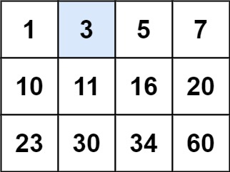

# [Question](https://leetcode.com/problems/search-a-2d-matrix/)
Difficulty: Medium
# Goal
In a 'sorted' matrix, do binary search. The matrix is made in a way such that,
- Each row is sorted in non-decreasing order.
- The first integer of each row is greater than the last integer of the previous row.  

Here's an example


# Solution
## Trick
Stretch this matrix out into a line (row after row making a sorted array). Then do standard binary search with left, right and middle pointers. When accessing elemenent do it this way - `matrix[mid/numColumns][mid%numColumns]`
The matrix is numbered in this way -  
| 0 | 1 | 2 |  
| 3 | 4 | 5 |
## Code
```cpp
bool searchMatrix(std::vector<std::vector<int>> matrix, int target) {
    int numRows = matrix.size(), numCols = matrix[0].size();
    int left = 0, right = numRows*numCols - 1, mid = 0, length = numRows*numCols;

    while(length > 0){
        mid = (left+right)/2;

        if(matrix[mid/numCols][mid%numCols] > target) right = mid - 1;
        else if(matrix[mid/numCols][mid%numCols] == target) return true;
        else left = mid + 1;
        length /= 2;
    }
    if(matrix[mid/numCols][mid%numCols] == target) return true;
    return false;
}
```
## Time Complexity: $O(log(m*n))$
As we strech the matrix out, it becomes a $m*n$ array.