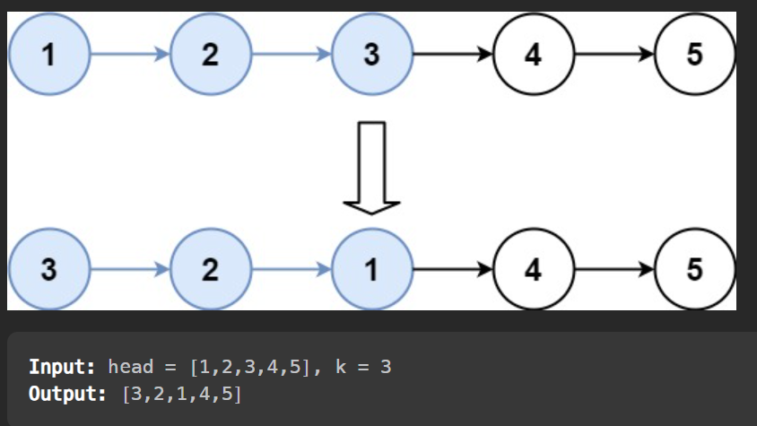
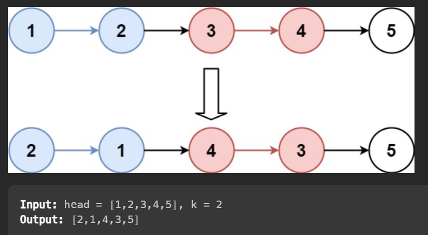

# [Question](https://leetcode.com/problems/reverse-nodes-in-k-group/)
Difficulty: Hard (edge cases are annoying and make this hard. Also $O(1)$ space is some pointer dark magic)
# Goal
Given a linked list, reverse the nodes of a linked list k at a time and return its modified list.


ex . 

# Solution
## Trick
I'm going to explain $O(n)$ space soln because it's easier to understand. The $O(1)$ space soln is some dark magic i'm afraid to implement. I'll try to explain it in end.

Create two vectors, startingptrs and endingptrs. Startingptrs store the start of grp, endingptrs store the end of grp. So startingptrs[0] starts the 1st grp, endingptrs[0] ends the first grp. Then reverse each grp. In end link startingptrs[i-1] with endingptrs[i] and voila!

The $O(1)$ space soln is basically this but it removes space by iteratively updating grpstart, groupend. And then linkes previous groupend with current groupstart. Something like that. It's a bit more complicated. I'll add a drawing.
<details>

<summary>
Drawing explanation</summary>

<image src="images/Reverse_llist_k_at_a_time1.jpg">
</image>
<image src="images/Reverse_llist_k_at_a_time2.jpg">
</details>

## Code
```cpp
ListNode* reverseKGroup(ListNode* head, int k) {
    vector<ListNode *> startingPtrs;
    vector<ListNode *> endingPtrs;
    vector<ListNode *> llist;
    int size = 0;
    ListNode *dummy = head;
    while(dummy != nullptr){
        llist.push_back(dummy);
        size++;
        dummy = dummy->next;
    }
    int i = 0;
    for (int j = 0; j < size / k; j += 1){
        startingPtrs.push_back(llist[i]);
        endingPtrs.push_back(llist[i + k - 1]);
        i += k;
    }
    if(i < size) endingPtrs.push_back(llist[i]);
    // reverse batches of k size
    for (auto ptr : startingPtrs)
        reverseList(ptr, k);

    i = 1;
    while(i < endingPtrs.size() && endingPtrs.size() > 1){
        startingPtrs[i - 1]->next = endingPtrs[i];
        i++;
    }

    return endingPtrs[0];
}
void reverseList(ListNode* &head, int k){
    ListNode *temp1 = nullptr, *temp2 = head, *temp3 = head->next;
    
    for (int i = 0; i < k; i++){
        temp2->next = temp1;
        temp1 = temp2;
        temp2 = temp3;
        temp3 = (temp3 != nullptr) ? temp3->next : nullptr;
    }
    
}
```
## Time Complexity: $O(n)$
We traverse the llist once to find the size. Then we traverse the llist again to find the starting and ending ptrs. Then we traverse the llist again to reverse the batches. Then we traverse the llist again to link the batches. So $O(4n)$ or $O(n)$.