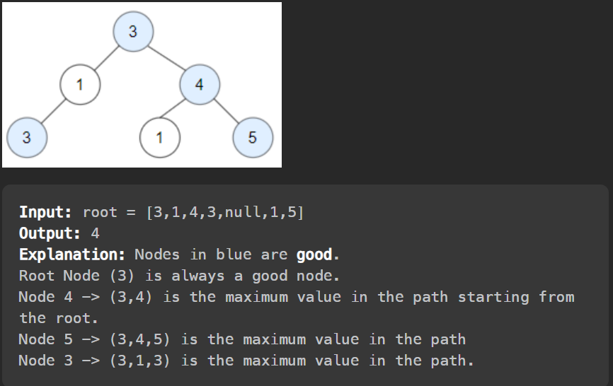

# [Question](https://leetcode.com/problems/count-good-nodes-in-binary-tree/)
Difficulty: Medium
# Goal
Find the number of 'good nodes'
good nodes are such nodes that getting to them from root, you may only pass through nodes with values less than or equal to the 'good' node's value.  
ex. 

# Solution
## Trick
My soln vs neetcode's smart soln
1. My soln - Use stack for storing good nodes' values (a non decreasing stack). At each node check if the top of the stack is less than the current node. If it is, then the current node is a good node. Add it to the stack. Then go left and right and repeat the process. (preorder traversal)
2. neetcode's soln - At every node, the number of good nodes is either 1 + left + right or 0 + left + right depending on whether the current node is a good node or not. Do this recursively and pass along the max value seen so far to determine if the current node is a good node or not. (postorder traversal)
## Code
Neetcode's soln -
```cpp
class Solution 
{
public:
    int goodNodes(TreeNode* root) 
    {
        return helper(root, root->val);
    }

    int helper(TreeNode* root, int maxSoFar)
    {
        if(not root) return 0;

        int res = (root->val >= maxSoFar) ? 1 : 0;
        res += helper(root->left, max(maxSoFar, root->val));
        res += helper(root->right, max(maxSoFar, root->val));

        return res;
    }
};
```
My soln -
```cpp
class Solution 
{
public:
    int goodNodes(TreeNode* root) 
    {
        goodStack.push(root);
        helper(root);
        return counter;
    }
private:
    void helper(TreeNode* node)
    {
        if(node == nullptr)
            return;
        
        if(node->val >= (goodStack.top())->val){
            counter++;
            goodStack.push(node); 
        }
        helper(node->right);
        helper(node->left);

        if(goodStack.top() == node)
            goodStack.pop();
        return;
    }
    int counter = 0;
    stack<TreeNode*> goodStack;
};
```

## Time Complexity: $O(n)$
My soln takes $O(n)$ space while neetcode's soln takes $O(h)$ space where $h$ is the height of the tree.