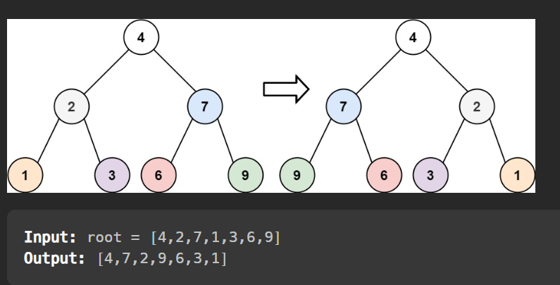

# [Question](https://leetcode.com/problems/invert-binary-tree/)
Difficulty: Easy
# Goal
The infamous invert binary tree. Basically swap left and right for every node in the tree. Return modified tree's head.


# Solution
## Trick
The solution is very easy, swap right and left child of a node, call the function recursively on left and right child. Done
## Code
```cpp
TreeNode* invertTree(TreeNode* root) {
    helper(root);
    return root;
}
void helper(TreeNode* root){
    if(root == nullptr) return; 
    TreeNode* temp = root->left;
    root->left = root->right;
    root->right = temp;
    helper(root->left);
    helper(root->right);
}
```
comment - using helper function is not necessary, but it makes the code more readable. 
## Time Complexity: $O(n)$
eace node is visited once, so $O(n)$