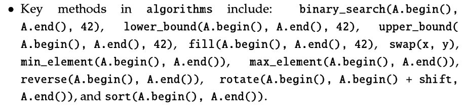

# cheatsheet for data structures

## Arrays and strings
### arrays
declaration - `array<type name, size> arrayName;`  
functions -
- `arrayName.at(index)` - returns element at index. If we try to access the element which is out of bounds of the array size then it throws an exception.
- `arrayName.data()` - returns pointer to the first element of the array
- `arrayName.fill(value)` - fills the array with value

arrays are contiguous blocks of memory.
- access: $O(1)$ 
- search: $O(n)$ ($O(logn)$ with binary search if sorted)
- insertion: $O(n)$
- deletion: $O(n)$

### vectors

bit of computer science 

vectors are dynamic arrays. They are implemented as arrays with a pointer to the first element, a pointer to the last element and a pointer to the end of the array. When the array is full, a new array is created with double the size and the elements are copied over. This is called amortized doubling. This is why insertion is O(1) most of the time. But sometimes it can be O(n) if the array is full and a new array has to be created.

declaration - `vector<type name> vectorName;`
constructor - `vector<type name> vectorName(size, value);`

functions -
- `vectorName.push_back(value)` - adds value to the end of the vector, $O(1)$
- `vectorName.pop_back()` - removes the last element of the vector, $O(1)$
- `vectorName.insert(iterator, value)` - inserts value before the iterator, $O(n)$
- `vectorName.erase(iterator)` - removes the element at the iterator, $O(n)$
- `vectorName.erase(iterator1, iterator2)` - removes the elements between iterator1 and iterator2 (iterator2 not included in deletion), $O(n)$
- `vectorName.clear()` - removes all the elements of the vector, $O(n)$
- `vectorName.reserve(newCapacity)` - reserves the memory for the newCapacity number of elements. If the newCapacity is less than the current capacity then nothing happens. If the newCapacity is greater than the current capacity then the capacity is increased to newCapacity and the elements are copied over. $O(n)$

vectors are contiguous blocks of memory.
- access: $O(1)$
- search: $O(n)$ ($O(logn)$ with binary search if sorted)
- insertion: $O(1)$ (amortized)
- deletion: $O(1)$ (amortized)

### strings
declaration - `string stringName;`

functions -
- `stringName.size()` - returns the size of the string, same as `stringName.length()`, $O(1)$
- `stringName.substr(startIndex, length)` - returns a substring of the string starting from `startIndex` and of length `length`, $O(n)$
- `stringName.find(stringToFind)` - returns the index of the first occurence of `stringToFind` in `stringName`. If `stringToFind` is not found then it returns `string::npos`, $O(n)$
- `stringName.erase(startIndex, length)` - erases the substring of stringName starting from startIndex and of length `length`, $O(n)$
- `stringName.push_back(character)` - appends character to the end of `stringName`, $O(1)$
- `stringName.pop_back()` - removes the last character of `stringName`, $O(1)$
 
- `stoi(stringName)` - converts `stringName` to an integer, $O(n)$, more details [here](https://www.geeksforgeeks.org/stdstoi-function-in-cpp/)
- `isalnum(character)` - returns true if character is alphanumeric ([a-z], [A-Z], [0-9]), $O(1)$

strings are contiguous blocks of memory.
- access: $O(1)$
- search: $O(n)$ 
- insertion: $O(n)$ ($O(1)$ if inserting at the end)
- deletion: $O(n)$ ($O(1)$ if deleting at the end)

## Stacks

declaration - `stack<type name> stackName;`

functions -
- `stackName.push(value)` - pushes value to the top of the stack, $O(1)$
- `stackName.pop()` - removes the top element of the stack, $O(1)$
- `stackName.top()` - returns the top element of the stack, $O(1)$
- `stackName.empty()` - returns true if the stack is empty, $O(1)$
- `stackName.size()` - returns the size of the stack, $O(1)$

stacks are implemented as a container adapter. By default, it is implemented as a deque. It can also be implemented as a list or a vector. It follows the LIFO (last in first out) principle. Its not possible to iterate over a stack.

- access: $O(n)$ ($O(1)$ for accessing the top element)
- search: $O(n)$
- insertion: $O(1)$
- deletion: $O(1)$

## Queues

### queues
Follows the FIFO (first in first out) principle. Its not possible to iterate over a queue.
declaration - `queue<type name> queueName;`

functions -
- `queueName.push(value)` - pushes value to the end of the queue, $O(1)$
- `queueName.pop()` - removes the first element of the queue, $O(1)$
- `queueName.front()` - returns the first element of the queue, $O(1)$
- `queueName.back()` - returns the last element of the queue, $O(1)$

queues are implemented as a container adapter. By default, it is implemented as a deque. It can also be implemented as a list or a vector.

- access: $O(n)$ ($O(1)$ for accessing the front and back element)
- search: $O(n)$
- insertion: $O(1)$
- deletion: $O(1)$

### deque
deque is a double ended queue. It can be used as a stack or a queue. It can also be used as a vector. It is implemented as a dynamic array. It is possible to iterate over a deque.

declaration - `deque<type name> dequeName;`

functions -
- `dequeName.push_back(value)` - pushes value to the end of the deque, $O(1)$
- `dequeName.pop_back()` - removes the last element of the deque, $O(1)$
- `dequeName.push_front(value)` - pushes value to the front of the deque, $O(1)$
- `dequeName.pop_front()` - removes the first element of the deque, $O(1)$
- `dequeName.front()` - returns the first element of the deque, $O(1)$
- `dequeName.back()` - returns the last element of the deque, $O(1)$
- `dequeName.at(index)` - returns the element at index, $O(1)$
- `dequeName.begin()` - returns an iterator to the first element of the deque, $O(1)$
- `dequeName.end()` - returns an iterator to the last element of the deque, $O(1)$

- access: $O(1)$
- search: $O(n)$
- insertion: $O(1)$
- deletion: $O(1)$

## Sets

### unordered set -  generally provide a constant time lookup operation. 
declaration - `unordered_set<type name> setName;`

functions -
- `setName.insert(value)` - inserts value into the set, $O(1)$ average, $O(n)$ worst case
- `setName.erase(value)` - removes value from the set, $O(1)$ average, $O(n)$ worst case
- `setName.find(value)` - returns an iterator to the element with value, $O(1)$ average, $O(n)$ worst case
- 

### ordered set
declaration - `set<type name> setName;`

functions -
- `setName.insert(value)` - inserts value into the set, $O(logn)$
- `setName.erase(value)` - removes value from the set, $O(logn)$
- `setName.find(value)` - returns an iterator to the element with value, $O(logn)$

